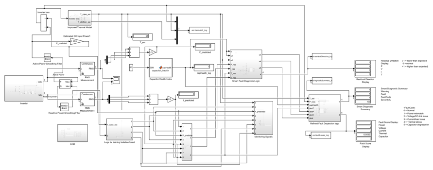

# Inverter Digital Twin for Condition Monitoring

Master's project developed in MATLAB/Simulink for replay-based monitoring of a solar irrigation inverter/controller.

The project compares monitored or simulated inverter signals with predicted healthy behaviour and uses the resulting residuals for fault diagnosis. The model includes PV/DC-link context, a three-phase inverter, an equivalent motor-pump load, thermal behaviour, fault injection, diagnostic scoring and logging for anomaly-detection work.

## What is included

- `Inverter_Model.slx` — main Simulink digital-twin model
- `Parameters_Inverter.m` — model parameters, operating cases and fault injections
- `RUN_ONE_FAULT.m` — runs an individual fault scenario and prints diagnostic outputs
- `Final_IF_V5_Locked_Evaluation.m` — locked Isolation Forest training and final evaluation pipeline
- `HealthyIFRaw_3hr_LoadV2.csv` — 3-hour healthy replay dataset used for Isolation Forest evaluation
- `model_overview.png` — overview of the Simulink model
- `project-summary.md` — short technical summary and project boundaries

## Model overview



## Main features

- PV array and averaged MPPT/DC-link operating context
- Three-phase inverter and equivalent motor-pump load
- Electrical and RC thermal modelling
- Residual monitoring for power, voltage, current and temperature
- Rule-based fault scoring and diagnostic codes
- Controlled fault/degradation scenarios
- Logging interfaces for Isolation Forest feature generation

## Fault cases

The parameter script currently supports:

- `healthy`
- `power`
- `voltage`
- `current`
- `thermal`
- `capacitor`
- `sensor_drift_voltage`
- `open_switch_proxy`

## Quick start

The model was created with MATLAB/Simulink R2024a and uses Simscape Electrical / Specialized Power Systems blocks.

Keep the three main project files in the same MATLAB folder, then run for example:

```matlab
faultCase = 'healthy';
RUN_ONE_FAULT
```

To test another case:

```matlab
faultCase = 'voltage';
RUN_ONE_FAULT
```

The run script uses the 9 kW rated case, rated load, a 10 s simulation and a fault start time of 2 s.

## Selected results from the dissertation

At the settled operating point:

- DC-link voltage: ~791.9 V
- DC input current: ~11.48 A
- DC input power: ~9.094 kW
- AC output power: ~8.812 kW
- Inverter loss: ~282 W
- Calculated efficiency: ~96.9%

The wider research also evaluated a 41-feature Isolation Forest framework. The reported final configuration achieved a mean confirmed detection rate of 89.41% for the evaluated gradual-degradation scenarios with 0% confirmed false alarms on the healthy holdout set. A simulated 30 V voltage drift was detected at about 72 s in the reported experiment.
## Isolation Forest results

The locked Isolation Forest was evaluated across five predefined seeds using a 99th-percentile healthy calibration threshold and 3-of-5 persistence.

The two gradual-degradation targets achieved approximately 80.3% confirmed detection for capacitor degradation and 98.5% for voltage sensor drift, giving a mean confirmed detection rate of 89.41%. The held-out healthy data produced 0% confirmed false alarms after persistence was applied.

### Final detection across evaluated scenarios


### Gradual degradation detection


### Voltage drift anomaly score


### Capacitor degradation anomaly score


## Important project boundary

This is a research prototype, not an OEM-validated inverter model. Several converter, thermal and component parameters are engineering assumptions because full proprietary inverter data and field fault data were not available. The reported results are simulation-based and require calibration against real Smart SIP field data before practical deployment.

The repository includes the locked Isolation Forest final-evaluation script and the healthy replay dataset required by it. The evaluation uses a fixed chronological train/calibration/development/final-test split and evaluates the locked configuration across five pre-declared random seeds.

## Author

Muhammad Wasib  
MSc Automotive Engineering — Birmingham City University
