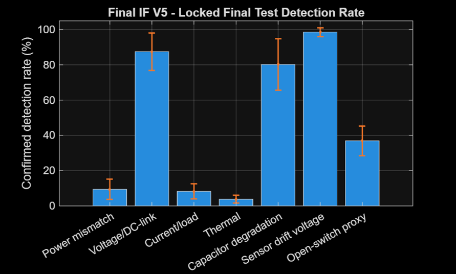
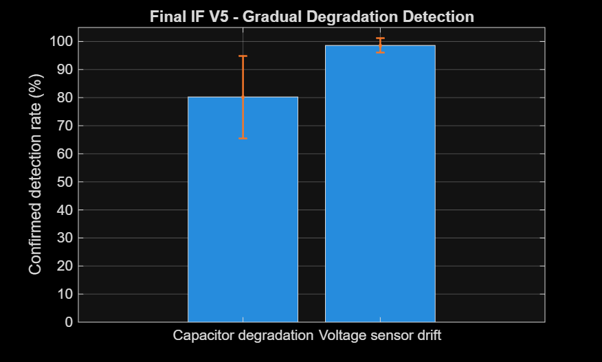
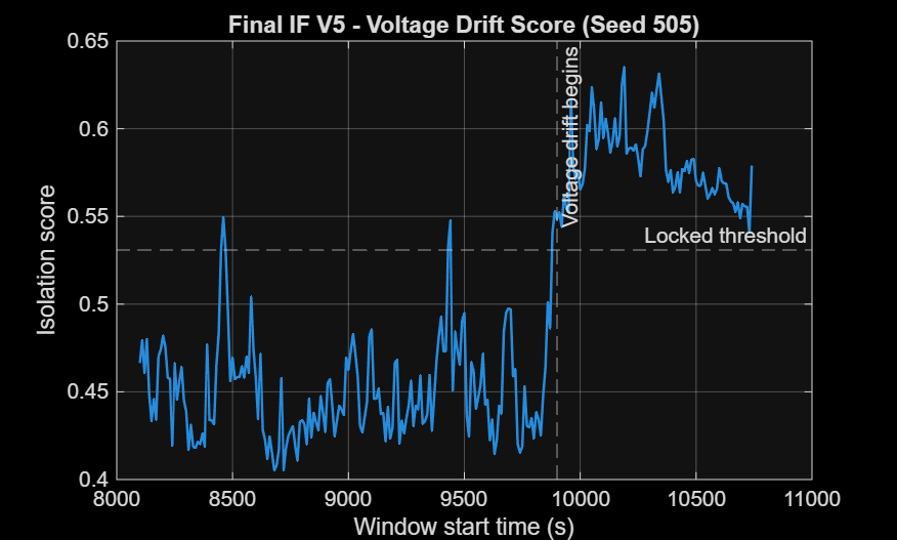
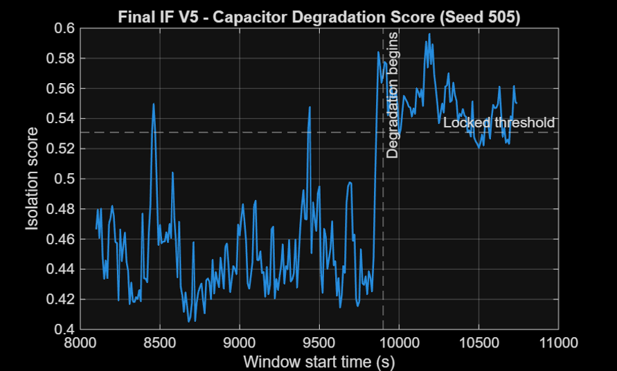

# Inverter Digital Twin for Condition Monitoring

Master's project developed in **MATLAB/Simulink** for replay-based monitoring, fault diagnosis and anomaly detection of a solar irrigation inverter/controller.

The project compares monitored or simulated inverter behaviour against predicted healthy operation using residual analysis. The digital twin includes PV/DC-link operating context, a three-phase inverter, equivalent motor-pump loading, thermal behaviour, controlled fault injection, diagnostic logic and an Isolation Forest based anomaly-detection framework.

---

# What is Included

- `Inverter_Model.slx` — Main MATLAB/Simulink digital twin model
- `Parameters_Inverter.m` — Model parameters, operating conditions and fault injection settings
- `RUN_ONE_FAULT.m` — Executes individual fault scenarios and generates diagnostic outputs
- `Final_IF_V5_Locked_Evaluation.m` — Locked Isolation Forest training and final evaluation pipeline
- `HealthyIFRaw_3hr_LoadV2.csv` — Healthy replay dataset used for anomaly detection evaluation
- `project-summary.md` — Technical project summary and scope description

## Visual Documentation

- `images/model_overview.png` — Simulink model overview
- `images/inverter_digital_twin_model.png` — Complete digital twin architecture

---

# Digital Twin Architecture

The Simulink model integrates inverter operation, thermal behaviour, fault injection, residual monitoring and diagnostic logic.


---

# Main Features

- PV array and averaged MPPT/DC-link operating context
- Three-phase inverter and equivalent motor-pump load modelling
- Electrical and RC thermal modelling
- Residual monitoring for voltage, current, power and temperature signals
- Rule-based diagnostic scoring and fault classification
- Controlled fault and degradation scenario generation
- Logging framework for Isolation Forest feature extraction

---

# Supported Fault Cases

The model currently supports:

- `healthy`
- `power`
- `voltage`
- `current`
- `thermal`
- `capacitor`
- `sensor_drift_voltage`
- `open_switch_proxy`

---

# Quick Start

The model was developed using:

- MATLAB/Simulink R2024a
- Simscape Electrical
- Specialized Power Systems

Keep the MATLAB files in the same directory.

Example:

```matlab
faultCase = 'healthy';
RUN_ONE_FAULT
```

To test another fault:

```matlab
faultCase = 'voltage';
RUN_ONE_FAULT
```

The evaluation uses the 9 kW rated operating case, rated load conditions, a 10 s simulation duration and a fault initiation time of 2 s.

---

# Selected Simulation Results

## Steady-State Operating Point

The developed inverter model achieved:

- DC-link voltage: ~791.9 V
- DC input current: ~11.48 A
- DC input power: ~9.094 kW
- AC output power: ~8.812 kW
- Inverter loss: ~282 W
- Calculated efficiency: ~96.9%

---

# Isolation Forest Evaluation

The anomaly detection framework used a **41-feature Isolation Forest pipeline** evaluated across five predefined random seeds.

The final locked configuration used:

- Healthy calibration threshold based on the 99th percentile
- 3-out-of-5 persistence confirmation logic
- Fixed chronological train/calibration/development/final-test split

The evaluated gradual degradation scenarios achieved:

- Capacitor degradation detection: ~80.3%
- Voltage sensor drift detection: ~98.5%
- Mean confirmed detection rate: **89.41%**
- Healthy holdout false alarms: **0%**

---

# Detection Performance



---

# Gradual Degradation Detection



---

# Voltage Drift Detection



---

# Capacitor Degradation Detection



---

# Project Boundary

This repository represents a research prototype and not an OEM-validated inverter product.

Several converter, thermal and component parameters are engineering assumptions because complete proprietary inverter specifications and field fault datasets were unavailable.

The reported results are simulation-based and require further calibration and validation using real operational inverter data before practical deployment.

---

# Limitations

- Uses replayed operational data rather than live inverter communication
- Fault scenarios are simulation-based and artificially injected
- Real-world deployment requires sensor integration and communication interfaces
- Additional validation with field measurements is required

---

# Future Work

Potential future developments include:

- Real-time SCADA/IoT data acquisition
- Hardware-in-the-loop validation
- Automated remaining useful life estimation
- Cloud-based monitoring dashboard
- Integration with real inverter controller data

---

# Author

**Muhammad Wasib**

MSc Automotive Engineering  
Birmingham City University

GitHub:
https://github.com/mwasib01

LinkedIn:
https://www.linkedin.com/in/muhammad-wasib-561463218/
